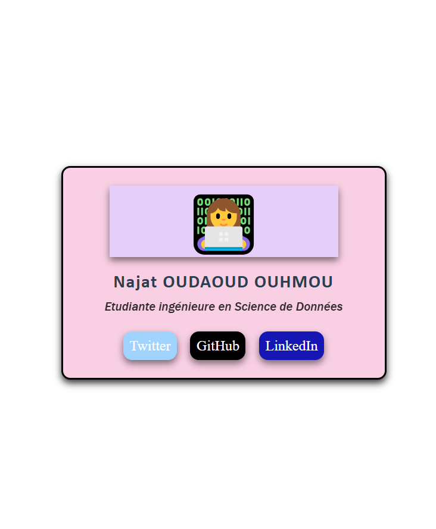

# 💳 Carte de Profil - CSS Flexbox



## 📌 Aperçu

Carte de profil professionnelle réalisée avec **HTML5** et **CSS3 (Flexbox)**.  
Design épuré, centrage parfait et effets visuels modernes.

## ✨ Fonctionnalités

- ✅ Centrage horizontal et vertical avec **Flexbox**
- ✅ Avatar personnalisé avec ombre et coins arrondis
- ✅ Icônes réseaux sociaux stylisées (Twitter, GitHub, LinkedIn)

## 🛠️ Technologies utilisées

| Technologie | Usage |
|-------------|-------|
| HTML5 | Structure |
| CSS3 | Style & mise en page |
| Flexbox | Alignement et centrage |

## 📱 Aperçu visuel


## 🚀 Installation

1. Clone le dépôt :
```bash
git clone https://github.com/NOuhmou/carte-profil-css.git
````
2. Ouvre index.html dans ton navigateur

## 📂 Structure du projet

````bash
carte-profil-css/
├── carte.html      # Structure HTML
├── style.css       # Styles CSS
└── carte.png  # Aperçu
````
## 👩‍💻 Auteur

Najat OUDAOUD OUHMOU
GitHub : @NOuhmou
